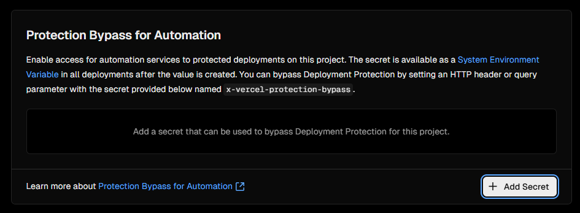
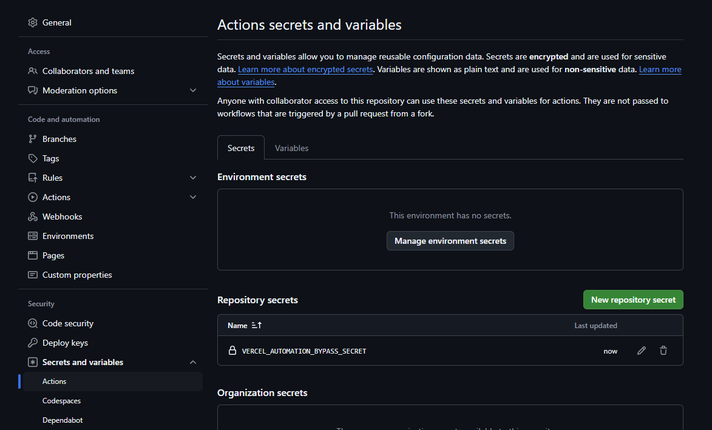
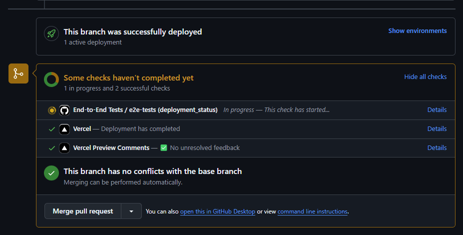

# Automated end-to-end tests recipie and code example

Repository with code example for [Automated end-to-end tests on Simple Frontend docs](https://www.simplefrontend.dev/docs/ci/automated-end-to-end-tests/)

## Local setup

1. We start by installing [Playwright](https://playwright.dev/docs/intro) and following the CLI:

```bash
pnpm create playwright --install-deps
```

> Where to put your end-to-end tests? e2e
> Add a Github Actions workflow? y
> Install Playwright browsers? y

The CLI added folders to our .gitignore configuration, packages to our dev dependencies and a created the following files:

- `playwright.config.ts` which is Playwright's configuration file
- `demo-todo-app.spec.ts` in `test-examples` which contains an advanced use case for a todo app covering most of large apps use cases. We will ignore this file but you can use it as a quick reference later
- `example.spec.ts` in e2e-tests which is where we will write our main tests for this demo

2. We update `playwright.config.ts`

For starters, let's focus on the simplest setup to make sure our website is up and running and its core functionality is running so we will remove tests for firefox and webkit for now under projects, comment them out.

We will add a BASE_URL env variable, under use add the following:

```javascript
use: {
  baseURL: process.env.BASE_URL;
}
```

3. We prepare our first test, update `example.spec.ts` with only one test case:

```javascript
test("is up and running", async ({ page }) => {
  const pageNavigation = await page.goto("/");

  expect(pageNavigation?.status()).toBe(200);
  await expect(page).toHaveTitle(/%YOUR_REGEX_TITLE%/);
});
```

Because we will be using `process.env.BASE_URL` - "/" will directly hit your base url path.

In my case, it will go to `https://automated-end-to-end-tests-example.vercel.app/` and I configured my title regex as `/Automated End-to-End Tests example/`

4. Test that everything is working:

Add a script to your package.json:

```json
    "e2e": "playwright test"
```

Run the script command using your preferred package manager:

```bash
BASE_URL=%YOUR_BASE_URL% pnpm run e2e
```

## CI Setup

There are many different setups you can go for such as running a local server to validate your end-to-end tests against but this is not what I would recommend. What will reaLLy bring value to you is running your end-to-end tests against your [preview deployments](https://www.simplefrontend.dev/docs/ci/preview-deployments/) before merging your changes to your main production branch.

So here it depends on your hosting setup and provider, I will cover the most popular ones.

### Vercel

If you synced your github repository with a vercel project, you should already have preview deployments running out of the box.

There is only a few more steps to take:

1. In your Vercel project settings, go to `Deployment Protection` and in the section `Protection Bypass for Automation`, click `Add Secret` and in the pop-up which opens immediately click `Save`



This will let Vercel know you are the one running automated tests against your preview environment and authorize the requests.

Copy the value of the secret, you will need it for the next step

2. In your github repository settings, go to `Secrets and variables` > `Actions` and add your secret value under the name `VERCEL_AUTOMATION_BYPASS_SECRET`



3. Let's update our github action yaml file which should be under `.github/workflows/playwright.yml` and copy the following, adapting with your favorite package manager:

```yaml
name: End-to-End Tests
on:
  deployment_status:
jobs:
  e2e-tests:
    if: github.event_name == 'deployment_status' && github.event.deployment_status.state == 'success' && github.event.deployment.environment == 'Preview'
    timeout-minutes: 10
    runs-on: ubuntu-latest
    steps:
      - uses: actions/checkout@v4
      - name: Install pnpm
        uses: pnpm/action-setup@v4
      - uses: actions/setup-node@v4
        with:
          node-version: lts/*
          cache: "pnpm"
      - name: Install dependencies
        run: pnpm install
      - name: Install Playwright Browsers
        run: pnpm exec playwright install --with-deps chromium
      - name: Environment URL
        run: echo ${{ github.event.deployment_status.environment_url }}
      - name: Run Playwright tests
        run: pnpm run e2e
        env:
          BASE_URL: ${{ github.event.deployment_status.environment_url }}
          VERCEL_AUTOMATION_BYPASS_SECRET: ${{ secrets.VERCEL_AUTOMATION_BYPASS_SECRET }}
      - uses: actions/upload-artifact@v4
        if: ${{ !cancelled() }}
        with:
          name: playwright-report
          path: playwright-report/
          retention-days: 1
```

This will run on every Vercel preview deployments and it will:

1. Checkout your repository
2. Install pnpm
3. Setup nodeJS
4. Install dependencies
5. Install Playwright browsers (in this example, I explicitely only require chromium)
6. Display the value of the environment URL against which the end-to-end tests will run
7. Run the tests
8. Upload their results so you can download and view the report HTML in case of failures

on Step 7 (Run Playwright tests), we are setting 2 environment variables, the BASE_URL for the preview deployment which Vercel gives us and the github action secret we just created

4. The final thing to do is to update our `playwright.config.ts` to send the `x-vercel-protection-bypass` header to Vercel, so we update the value of `use` to:

```javascript
  use: {
    trace: "on-first-retry",
    baseURL: process.env.BASE_URL,
    extraHTTPHeaders: {
      "x-vercel-protection-bypass": process.env.VERCEL_AUTOMATION_BYPASS_SECRET!,
      "x-vercel-set-bypass-cookie": "true",
    },
  },
```

We also set `x-vercel-set-bypass-cookie` to true so the header value is also sent on subsequent requests should we need it. [Read more](https://vercel.com/docs/security/deployment-protection/methods-to-bypass-deployment-protection/protection-bypass-automation)

5. Test everything

Merge the changes to your main branch, create a small changeset on any branch and create a pull request against your main branch and you should see your new workflow running:



It will run again on every push!
